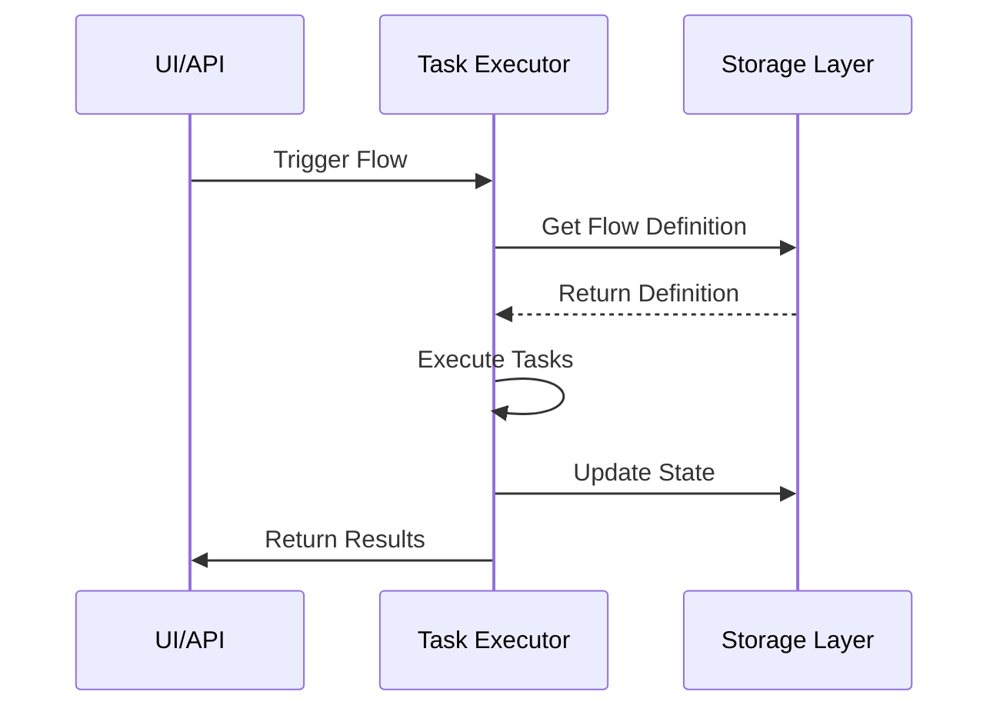

# Workflow Orchestration & Kestra Learning Path

## Mục Lục
1. [Giới Thiệu](#giới-thiệu)
2. [Workflow Orchestration Fundamentals](#1-workflow-orchestration-fundamentals)
3. [Kestra Platform](#2-kestra-platform)
4. [Thực Hành](#3-thực-hành)
5. [Best Practices](#4-best-practices)
6. [Resources & Community](#5-resources--community)

## Giới Thiệu

Workflow Orchestration là một phần quan trọng trong Data Engineering, giúp tự động hóa và quản lý các quy trình xử lý dữ liệu phức tạp. Kestra là một công cụ orchestration hiện đại, mã nguồn mở, được thiết kế để xử lý các workflow phức tạp với khả năng real-time processing.

## 1. Workflow Orchestration Fundamentals (2-3 tuần)

### 1.1 Khái Niệm Cơ Bản

#### a. Workflow Fundamentals
- **Workflow là gì?**
  - Định nghĩa: Chuỗi các task được thực thi theo thứ tự
  - Components: Tasks, Dependencies, Triggers
  - Lifecycle: Creation → Scheduling → Execution → Monitoring
- **Task và Task Types**
  - Computation tasks
  - Data movement tasks
  - Notification tasks
  - Custom tasks

#### b. Dependencies Management

##### 1. Task Dependencies Cơ Bản
- **Định nghĩa**: Mối quan hệ phụ thuộc giữa các tasks trong workflow
- **Cú pháp cơ bản**:
  ```yaml
  id: basic-dependencies
  namespace: example
  
  tasks:
    - id: extract_data
      type: io.kestra.core.tasks.scripts.Python
      script: |
        print("Extracting data...")
    
    - id: transform_data
      dependsOn: 
        - extract_data    # Transform chỉ chạy sau khi extract hoàn thành
      type: io.kestra.core.tasks.scripts.Python
      script: |
        print("Transforming data...")
    
    - id: load_data
      dependsOn: 
        - transform_data  # Load chỉ chạy sau khi transform hoàn thành
      type: io.kestra.core.tasks.scripts.Python
      script: |
        print("Loading data...")
  ```

##### 2. Các Loại Dependencies

###### a. Direct Dependencies (Phụ thuộc trực tiếp)
```yaml
tasks:
  - id: prepare_data
    type: io.kestra.core.tasks.scripts.Shell
    commands:
      - echo "Preparing data..."
    
  - id: process_data
    dependsOn: 
      - prepare_data    # Phụ thuộc trực tiếp
    type: io.kestra.core.tasks.scripts.Shell
    commands:
      - echo "Processing data..."
```

###### b. Cross-workflow Dependencies (Phụ thuộc chéo)
```yaml
# Workflow chính
id: main_workflow
namespace: production

tasks:
  - id: trigger_sub_workflow
    type: io.kestra.core.tasks.flows.Flow
    namespace: production
    flowId: sub_workflow    # Gọi workflow khác
    inputs:
      date: "{{ outputs.previous_task.date }}"

# Workflow phụ
id: sub_workflow
namespace: production

inputs:
  - name: date
    type: string

tasks:
  - id: process_date
    type: io.kestra.core.tasks.scripts.Shell
    commands:
      - echo "Processing date {{ inputs.date }}"
```

###### c. Time-based Dependencies (Phụ thuộc thời gian)
```yaml
triggers:
  - id: daily_schedule
    type: schedule
    cron: "0 0 * * *"    # Chạy hàng ngày lúc 00:00
    
  - id: weekly_schedule
    type: schedule
    cron: "0 0 * * MON"  # Chạy mỗi thứ 2
    
tasks:
  - id: time_dependent_task
    type: io.kestra.core.tasks.scripts.Shell
    commands:
      - echo "Running at scheduled time"
```

###### d. Data Dependencies (Phụ thuộc dữ liệu)
```yaml
tasks:
  - id: check_data_exists
    type: io.kestra.core.tasks.scripts.Shell
    commands:
      - test -f "data.csv" || exit 1
    
  - id: process_data
    dependsOn:
      - check_data_exists
    type: io.kestra.core.tasks.scripts.Python
    script: |
      import pandas as pd
      df = pd.read_csv("data.csv")
      # Process data
```

##### 3. Dependency Patterns

###### a. Sequential Pattern (Tuần tự)
```yaml
tasks:
  - id: task_1
    type: io.kestra.core.tasks.scripts.Shell
    
  - id: task_2
    dependsOn: [task_1]
    
  - id: task_3
    dependsOn: [task_2]
```

###### b. Fan-out Pattern (Phân nhánh)
```yaml
tasks:
  - id: source_task
    type: io.kestra.core.tasks.scripts.Shell
    
  - id: branch_1
    dependsOn: [source_task]
    
  - id: branch_2
    dependsOn: [source_task]
    
  - id: branch_3
    dependsOn: [source_task]
```

###### c. Fan-in Pattern (Hội tụ)
```yaml
tasks:
  - id: branch_1
    type: io.kestra.core.tasks.scripts.Shell
    
  - id: branch_2
    type: io.kestra.core.tasks.scripts.Shell
    
  - id: final_task
    dependsOn: 
      - branch_1
      - branch_2
```

##### 4. Error Handling trong Dependencies

###### a. Retry Logic
```yaml
tasks:
  - id: sensitive_task
    type: io.kestra.core.tasks.scripts.Shell
    retry:
      maxAttempts: 3
      delay: PT1M      # Delay 1 phút giữa các lần retry
      multiplier: 2    # Tăng delay gấp đôi mỗi lần
```

###### b. Conditional Dependencies
```yaml
tasks:
  - id: task_with_condition
    type: io.kestra.core.tasks.scripts.Shell
    conditions:
      - type: io.kestra.core.models.conditions.ExecutionStatusCondition
        in:
          - SUCCESS
          - WARNING
```

##### 5. Best Practices

1. **Tổ chức Dependencies**
   - Giữ dependencies đơn giản và rõ ràng
   - Tránh tạo các chu trình phụ thuộc
   - Sử dụng meaningful task IDs

2. **Error Handling**
   - Luôn có retry strategy cho critical tasks
   - Implement proper error notifications
   - Log đầy đủ thông tin để debug

3. **Testing**
   - Test dependencies trước khi deploy
   - Validate workflow structure
   - Kiểm tra các edge cases

### 1.2 Advanced Concepts

#### a. Error Handling
- **Retry Mechanisms**
  ```yaml
  retry:
    maxAttempts: 3
    delay: PT1M
    multiplier: 2
  ```
- **Failure Scenarios**
  - Task failure
  - Dependency failure
  - Resource constraints

#### b. Monitoring & Logging
- **Metrics Collection**
  - Execution time
  - Success/Failure rates
  - Resource utilization
- **Log Management**
  - Centralized logging
  - Log levels
  - Log retention

## 2. Kestra Platform (3-4 tuần)

### 2.1 Platform Overview

#### a. Architecture
```
┌─────────────────────────────────────────────────────────┐
│                     UI / API Layer                      │
├─────────────────────────────────────────────────────────┤
│                                                         │
│   ┌─────────────┐        ┌─────────────────────┐        │
│   │             │        │     Web Interface   │        │
│   │  REST API   │        │   - Flow Management │        │
│   │             │        │   - Monitoring      │        │
│   └─────────────┘        │   - Analytics       │        │
│                          └─────────────────────┘        │
│                                                         │
├─────────────────────────────────────────────────────────┤
│                    Executor Layer                       │
├─────────────────────────────────────────────────────────┤
│                                                         │
│   ┌─────────────┐        ┌─────────────────────┐        │
│   │  Scheduler  │        │    Task Executor    │        │
│   │  - Timing   │        │   - Task Running    │        │
│   │  - Triggers │        │   - Error Handling  │        │
│   └─────────────┘        └─────────────────────┘        │
│                                                         │
├─────────────────────────────────────────────────────────┤
│                    Storage Layer                        │
├─────────────────────────────────────────────────────────┤
│                                                         │
│   ┌─────────────┐        ┌─────────────────────┐        │
│   │  Metadata   │        │       Logs &        │        │
│   │   Store     │        │     Flow State      │        │
│   └─────────────┘        └─────────────────────┘        │
│                                                         │
└─────────────────────────────────────────────────────────┘
```

#### b. Key Components

##### 1. Kiến Trúc Tổng Quan
```
┌─────────────────────────────────────────────────────────┐
│                     UI / API Layer                      │
├─────────────────────────────────────────────────────────┤
│                                                         │
│   ┌─────────────┐        ┌─────────────────────┐        │
│   │             │        │     Web Interface    │       │
│   │  REST API   │        │   - Flow Management  │       │
│   │             │        │   - Monitoring       │       │
│   └─────────────┘        │   - Analytics       │        │
│                          └─────────────────────┘        │
│                                                         │
├─────────────────────────────────────────────────────────┤
│                    Executor Layer                       │
├─────────────────────────────────────────────────────────┤
│                                                         │
│   ┌─────────────┐        ┌─────────────────────┐        │
│   │  Scheduler  │        │    Task Executor    │        │
│   │  - Timing   │        │   - Task Running    │        │
│   │  - Triggers │        │   - Error Handling  │        │
│   └─────────────┘        └─────────────────────┘        │
│                                                         │
├─────────────────────────────────────────────────────────┤
│                    Storage Layer                        │
├─────────────────────────────────────────────────────────┤
│                                                         │
│   ┌─────────────┐        ┌─────────────────────┐        │
│   │  Metadata   │        │       Logs &        │        │
│   │   Store     │        │     Flow State      │        │
│   └─────────────┘        └─────────────────────┘        │
│                                                         │
└─────────────────────────────────────────────────────────┘
```

##### 2. Chi Tiết Các Thành Phần

###### a. UI/API Layer (Tầng Giao Diện)
1. **Web Interface**
   - Dashboard quản lý workflows
   - Monitoring và tracking execution
   - Flow visualization
   - Real-time logs
   ```yaml
   # Ví dụ cấu hình UI server
   kestra:
     server:
       port: 8080
       interface: "0.0.0.0"
   ```

2. **REST API**
   - API endpoints cho automation
   - Programmatic access
   - Webhook integration
   ```bash
   # Ví dụ gọi API
   curl -X POST http://localhost:8080/api/v1/executions \
     -H "Content-Type: application/json" \
     -d '{"namespace": "dev", "flowId": "example-flow"}'
   ```

###### b. Executor Layer (Tầng Thực Thi)
1. **Scheduler**
   - Quản lý timing của workflows
   - Xử lý triggers
   - Queue management
   ```yaml
   # Ví dụ cấu hình scheduler
   triggers:
     - id: schedule
       type: schedule
       cron: "0 * * * *"  # Chạy mỗi giờ
   ```

2. **Task Executor**
   - Thực thi các tasks
   - Resource management
   - Error handling
   ```yaml
   # Ví dụ task execution
   tasks:
     - id: complex_task
       type: io.kestra.core.tasks.scripts.Python
       concurrent: 5  # Số lượng task có thể chạy đồng thời
       retry:
         maxAttempts: 3
   ```

###### c. Storage Layer (Tầng Lưu Trữ)
1. **Metadata Store**
   - Lưu trữ flow definitions
   - Task configurations
   - Execution history
   ```yaml
   # Ví dụ cấu hình storage
   kestra:
     repository:
       type: postgres
       postgres:
         url: jdbc:postgresql://localhost:5432/kestra
         username: kestra
         password: secret
   ```

2. **Logs & Flow State**
   - Execution logs
   - Task states
   - Performance metrics
   ```yaml
   # Ví dụ cấu hình logging
   kestra:
     logging:
       level: INFO
       path: /var/log/kestra
       retention: 30d
   ```

##### 3. Tương Tác Giữa Các Components

1. **Flow Execution Process**

#### 


2. **Data Flow**
```
UI/API → Executor → Storage
  ↑         ↓         ↑
  └─────────┴─────────┘
     State Updates
```

##### 4. Configuration Examples

###### a. Basic Setup
```yaml
kestra:
  repository:
    type: postgres
  queue:
    type: kafka
  storage:
    type: local
    local:
      basePath: "/tmp/kestra"
```

###### b. Advanced Configuration
```yaml
kestra:
  server:
    port: 8080
    interface: "0.0.0.0"
  repository:
    type: postgres
    postgres:
      url: jdbc:postgresql://localhost:5432/kestra
      username: kestra
      password: ${KESTRA_DB_PASSWORD}
  queue:
    type: kafka
    kafka:
      client:
        bootstrap.servers: localhost:9092
  storage:
    type: minio
    minio:
      endpoint: http://minio:9000
      access-key: minioadmin
      secret-key: ${MINIO_SECRET_KEY}
      bucket: kestra
```

##### 5. Best Practices

1. **Scaling Components**
   - Horizontal scaling cho executors
   - Load balancing cho UI/API
   - Distributed storage cho high availability

2. **Security**
   - Authentication cho UI/API
   - Encryption cho sensitive data
   - Role-based access control

3. **Monitoring**
   - Health checks cho mỗi component
   - Metrics collection
   - Alert configuration

### 2.2 Core Features

#### a. Flow Definition
```yaml
id: example-flow
namespace: dev

triggers:
  - id: schedule
    type: schedule
    cron: "0 0 * * *"

tasks:
  - id: task-1
    type: io.kestra.core.tasks.scripts.Python
    script: |
      print("Hello from Python!")

  - id: task-2
    type: io.kestra.core.tasks.notifications.Slack
    url: "{{ secret.SLACK_WEBHOOK }}"
    message: "Task completed!"
```

#### b. Variables & Templating
- **Environment Variables**
  ```yaml
  variables:
    DATABASE_URL: "postgresql://localhost:5432/db"
    API_KEY: "{{ secret.API_KEY }}"
  ```
- **Runtime Variables**
  ```yaml
  inputs:
    - name: date
      type: datetime
      default: "{{ now() }}"
  ```

#### c. Triggers & Scheduling
- **Cron Scheduling**
- **Event-based Triggers**
- **Webhook Triggers**
- **Custom Trigger Logic**

### 2.3 Advanced Features

#### a. Real-time Processing
```yaml
triggers:
  - id: kafka
    type: io.kestra.plugin.kafka.Trigger
    topic: "data-stream"
    bootstrapServers: "localhost:9092"
```

#### b. API Integration
```yaml
tasks:
  - id: api-call
    type: io.kestra.core.tasks.http.Request
    url: "https://api.example.com/data"
    method: GET
    headers:
      Authorization: "Bearer {{ secret.API_TOKEN }}"
```

## 3. Thực Hành

### 3.1 Basic Projects

#### Project 1: Data Pipeline Cơ Bản
```yaml
id: basic-etl
namespace: training

tasks:
  - id: extract
    type: io.kestra.plugin.jdbc.Query
    url: "{{ inputs.DATABASE_URL }}"
    username: "{{ secret.DB_USER }}"
    password: "{{ secret.DB_PASSWORD }}"
    sql: "SELECT * FROM users"

  - id: transform
    type: io.kestra.core.tasks.scripts.Python
    script: |
      import pandas as pd
      # Transform data
      
  - id: load
    type: io.kestra.plugin.elasticsearch.Load
    index: "users"
```

#### Project 2: Multi-Task Workflow
- Task dependencies
- Error handling
- Notifications
- Monitoring

### 3.2 Advanced Projects

#### Project 1: Real-time Data Processing
- Kafka integration
- Stream processing
- Real-time monitoring
- Error recovery

#### Project 2: API Integration Pipeline
- REST API integration
- Authentication
- Rate limiting
- Error handling

## 4. Best Practices

### 4.1 Development Best Practices
- Version control integration
- Testing strategy
- Documentation
- Code review process
- CI/CD integration

### 4.2 Production Best Practices
- Monitoring setup
- Alert configuration
- Backup procedures
- Scaling guidelines
- Security considerations

## 5. Resources & Community

### Official Resources
- [Kestra Documentation](https://kestra.io/docs)
- [Kestra GitHub](https://github.com/kestra-io/kestra)
- [Kestra Examples](https://kestra.io/examples)

### Community Resources
- Discord Channel: [Join Kestra Community](https://discord.gg/kestra)
- Stack Overflow: [kestra] tag
- GitHub Discussions

### Learning Path
1. **Beginner Level**
   - Setup local environment
   - Run example workflows
   - Understand basic concepts

2. **Intermediate Level**
   - Create custom workflows
   - Implement error handling
   - Add monitoring

3. **Advanced Level**
   - Complex workflow design
   - Custom plugin development
   - Production deployment
   - Performance optimization

## How to Run

### Environment Setup
1. **Start Kestra and dependencies**:
   ```bash
   chmod +x run.sh && ./run.sh
   ```
   This script will:
   - Stop and remove existing Docker containers
   - Start new Kestra container
   - Upload all workflow files from the flows directory

2. **Access Kestra UI**:
   - Open your browser and go to: http://localhost:8080/ui
   - Browse workflows, executions, and monitor tasks

### Running Workflows

1. **Using the UI**:
   - Navigate to Flows section
   - Find your workflow and click "Execute"
   - Fill in any required inputs
   - Monitor execution in real-time

2. **Using the API**:
   ```bash
   # Run a workflow with default parameters
   curl -X POST "http://localhost:8080/api/v1/executions/{namespace}/{flow_id}"
   
   # Run a workflow with custom parameters
   curl -X POST "http://localhost:8080/api/v1/executions/{namespace}/{flow_id}" \
     -H "Content-Type: application/json" \
     -d '{"inputs": {"parameter1": "value1", "parameter2": "value2"}}'
   
   # Example: Run the simple-test flow in data-engineer namespace
   curl -X POST "http://localhost:8080/api/v1/executions/data-engineer/simple-test"
   curl -X POET "http://localhost:8080/api/v1/executions/data-engineer/basic-dependencies"
   ```

3. **Check execution status**:
   ```bash
   curl -s "http://localhost:8080/api/v1/executions/{namespace}/{flow_id}/{execution_id}" | jq
   ```

### Troubleshooting

1. **View container logs**:
   ```bash
   docker-compose logs -f kestra
   ```

2. **API health check**:
   ```bash
   curl -s http://localhost:8080/api/health
   ```

3. **Common issues**:
   - Flow validation errors: Check YAML syntax and task types
   - Container access issues: Ensure ports are correctly mapped
   - Storage errors: Verify volume mounts and permissions

## Tips for Success
1. Start with simple workflows
2. Practice regularly
3. Join the community
4. Document your learning
5. Share your experience

---

Remember: Workflow orchestration is about bringing order to chaos. Take time to understand the fundamentals before diving into complex features.

Happy Orchestrating! 🚀


